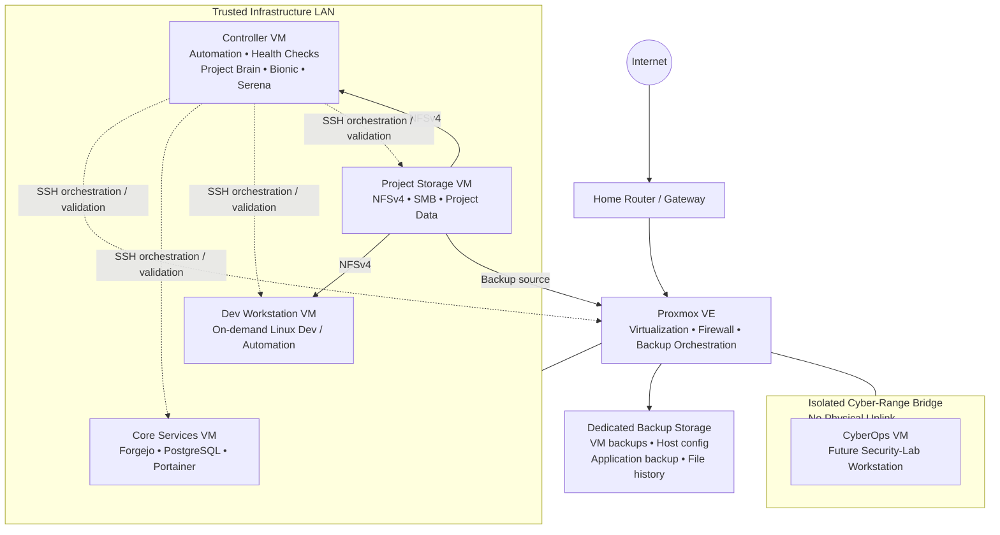
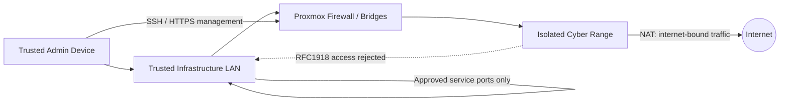

# Architecture

## System architecture

## Network segmentation

## Compute roles

- **Proxmox host** — hypervisor, virtual networking, firewalling, backup orchestration
- **Core services VM** — source control, database, container management
- **Controller VM** — administration, SSH orchestration, health checks, AI-assisted operations
- **Dev workstation VM** — on-demand Linux development and automation
- **Project storage VM** — shared NFS/SMB storage and recovery source
- **CyberOps VM** — future isolated security-lab workstation

## Storage and recovery

Recovery is layered:

1. VM-level backup for operating-system recovery
2. host/application configuration backup
3. file-level project-data mirror
4. changed/deleted-file history
5. checksum-based integrity validation
6. tested historical file restoration

## Design principle

New services are added only when they demonstrate a useful infrastructure, networking, automation, or cybersecurity skill.