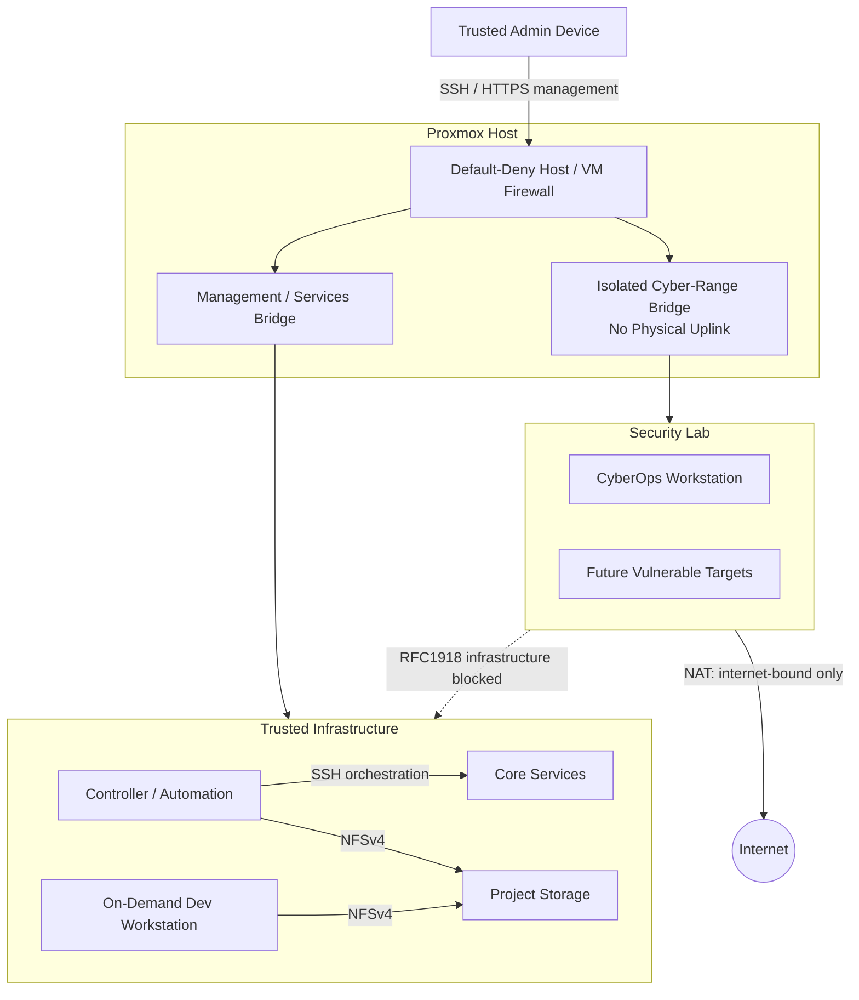

# Network & Security Segmentation

The public diagram intentionally describes trust boundaries and allowed flows without publishing internal host addresses.

## Policy intent

- Infrastructure management is limited to trusted internal paths.
- Published container services are filtered at the Proxmox virtual-NIC edge.
- Database services remain container-internal.
- Controller application services are loopback- or overlay-network-bound.
- The security-lab bridge has no physical uplink.
- Lab traffic cannot freely reach normal private infrastructure.
- Unnecessary listeners are disabled when functionality is preserved.